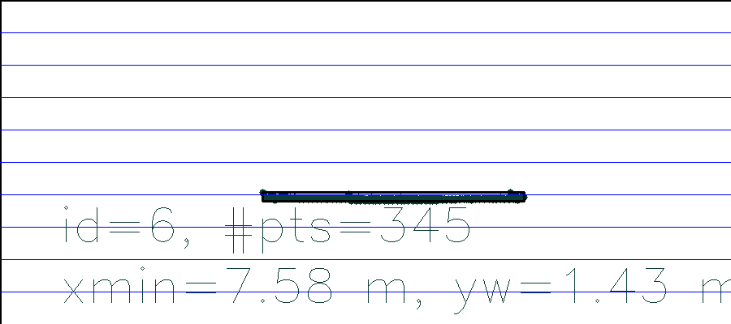
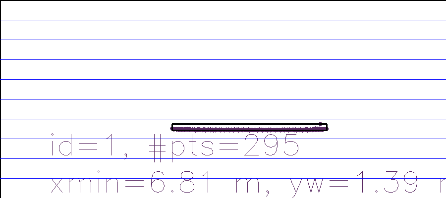

# Report for Project SFND 3D Object Tracking
[Rubric](https://review.udacity.com/#!/rubrics/2550/view) Points
---
#### 1. FP.1 Match 3D Objects
Implement function matchBoundingBoxes in lines 236-301 in camFusion_Student.cpp

#### 2. FP.2 Compute Lidar-based TTC
Implement function computeTTCLidar in lines 214-233 in camFusion_Student.cpp

#### 3. FP.3 Associate Keypoint Correspondences with Bounding Boxes
Implement function clusterKptMatchesWithROI in lines 134-141 in camFusion_Student.cpp

#### 4. FP.4 Compute Camera-based TTC
Implement function computeTTCCamera in lines 162-211 in camFusion_Student.cpp. The implementation is mainly based on the exercise in lesson 3.

#### 5. FP.5 Performance Evaluation 1, focusing on LiDAR TTC estimation
The TTC estimated using LiDAR data is quite good and stable. In my implementation, the median point, rather than the closet point, has been taken to estimate the TTC. Thus, it significantly reduce the effect of outliers and makes the TTC estimation more robust.Some samples are shown below. More samples can be found in [results](./results/) and the estimated TTC is written in [result.csv](./results/result.csv).

Image Index  | Image              | TTC (s)
--------  | --------------------| -------------------
4      |     | 11.98
18     |      | 8.40

#### 6. FP.6 Performance Evaluation 2
All possible combinations of detector and descriptor have been tested and the resrults are saved in [result.csv](./results/result.csv). Several coombinations, i.e., AKAZE/AKAZE, SHITOMASI/SIFT and FAST/BRIEF, produce reliable TTC estimations. However, combinations that use Harris and ORB detectors usually output poor results. Sometimes [negative](./results/negative_TTC_camera.png) TTC is produced and I think the reason is that keypoints in the ROI which do not belong to the preceding vehicle are also included. The result of AKAZE/SIFT combination can be found below. 

| Detector  | Descriptor | Img Index | TTC Lidar  | TTC Camera |
|-----------|------------|-----------|------------|------------|
| AKAZE|	SIFT|	1|	12,5156|	13,0026|
| AKAZE|	SIFT|	2|	12,6142|	15,4089|
| AKAZE|    SIFT|	3|	14,091|	13,7264|
| AKAZE|	SIFT|	4|	16,6894	|15,2099|
| AKAZE|	SIFT|	5|	15,7465	|18,6318|
| AKAZE|	SIFT|	6|	12,7835|	15,293|
| AKAZE|	SIFT|	7|	11,9844	|17,4369|
| AKAZE|	SIFT|	8|	13,1241	|14,5612|
| AKAZE|	SIFT|	9|	13,0241	|15,6282|
| AKAZE|	SIFT|	10|	11,1746	|12,1401|
| AKAZE|	SIFT|	11|	12,8086	|13,7017|
| AKAZE|	SIFT|	12|	8,95978	|15,6889|
| AKAZE|	SIFT|	13|	9,96439	|11,2365|
| AKAZE|	SIFT|	14|	9,59863|	10,602|
| AKAZE|	SIFT|	15|	8,52157|	10,7229|
| AKAZE|	SIFT|	16|	9,51552|	11,031|
| AKAZE|	SIFT|	17|	9,61241|	10,2394|
| AKAZE|	SIFT|	18|	8,3988	|8,96532|
